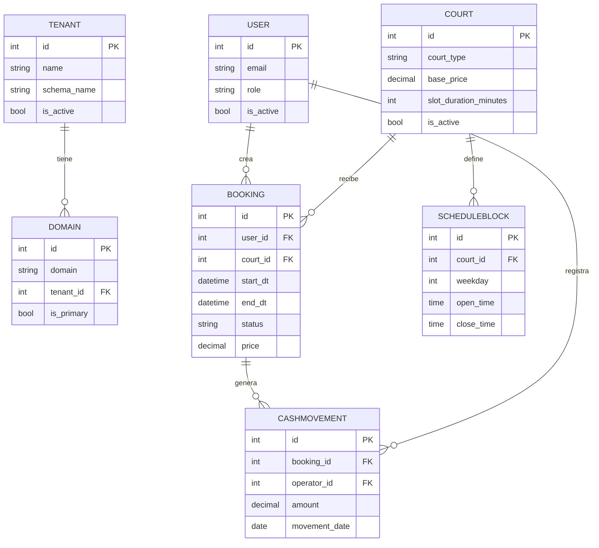

# DER.md
# Modelo de Datos Core (DER) — SaaS Gestión de Canchas

> Entregable de Sprint 0 ("DER core validado"). Coherente con `ARCHITECTURE.md` §6. Toda entidad
> tiene `is_active` (soft-delete), `created_at` y `updated_at`. Fechas/horas en **UTC**.

## 1. Esquemas (multi-tenant)

`django-tenants` separa los datos en dos planos:

| Esquema | Apps | Entidades |
|---|---|---|
| `public` (shared) | `tenants` | `Tenant`, `Domain` |
| Esquema por tenant | `users`, `courts`, `bookings`, `cashbox` | `User`, `Court`, `ScheduleBlock`, `Booking`, `CashMovement` |

> **`User` vive en TENANT_APPS (ADR-007):** cada complejo tiene su propia tabla de usuarios en su esquema;
> un usuario no existe en otro complejo. El staff (`tenant_admin`/`operator`) y los `player` se distinguen
> por `role`. El `system_admin` es el superuser del esquema `public` (gestiona tenants, no datos de negocio).

## 2. Entidades

### Tenant (esquema `public`)
| Campo | Tipo | Nota |
|---|---|---|
| `id` | PK | |
| `name` | str | Nombre del complejo |
| `schema_name` | str | Esquema PostgreSQL del tenant (único) |
| `is_active`, `created_at`, `updated_at` | | soft-delete + timestamps |

### Domain (esquema `public`)
| Campo | Tipo | Nota |
|---|---|---|
| `id` | PK | |
| `domain` | str | Dominio/subdominio que resuelve el tenant |
| `tenant_id` | FK → Tenant | |
| `is_primary` | bool | |

### User (Custom, `AbstractUser`)
| Campo | Tipo | Nota |
|---|---|---|
| `id` | PK | |
| `username` / `email` | str | credenciales |
| `role` | enum | `tenant_admin` \| `operator` \| `player` (ver `RBAC.md`) |
| `is_active`, `created_at`, `updated_at` | | |

> `system_admin` opera en `public` (gestión de tenants), no es un rol de negocio dentro del tenant.

### Court (Cancha) — esquema tenant
| Campo | Tipo | Nota |
|---|---|---|
| `id` | PK | |
| `name` | str | Identificación de la cancha |
| `court_type` | enum | `FUTBOL_5` \| `FUTBOL_7` \| `PADEL` |
| `surface` | str | Superficie |
| `base_price` | decimal | Precio base del turno |
| `slot_duration_minutes` | int | **Duración del turno** de esta cancha (ej: 60 / 90). Ver `WORKFLOW.md` |
| `is_active`, `created_at`, `updated_at` | | |

### ScheduleBlock (disponibilidad) — esquema tenant
| Campo | Tipo | Nota |
|---|---|---|
| `id` | PK | |
| `court_id` | FK → Court | |
| `weekday` | int | Día de la semana (0-6) |
| `open_time` | time | Apertura |
| `close_time` | time | Cierre |
| `is_active`, `created_at`, `updated_at` | | |

### Booking (Reserva) — esquema tenant
| Campo | Tipo | Nota |
|---|---|---|
| `id` | PK | |
| `user_id` | FK → User (**nullable**) | jugador registrado (si reservó con cuenta). Ver ADR-008 |
| `guest_name` | str (nullable) | nombre del jugador invitado (si reservó sin cuenta) |
| `guest_phone` | str (nullable) | teléfono del invitado (no exponer en listados públicos) |
| `court_id` | FK → Court | |
| `start_dt` | datetime (UTC) | inicio del turno |
| `end_dt` | datetime (UTC) | fin del turno (= `start_dt` + `slot_duration_minutes`) |
| `status` | enum | `PENDING_PAYMENT` \| `CONFIRMED` \| `CANCELLED` \| `COMPLETED` (ver `WORKFLOW.md`) |
| `price` | decimal | precio del turno calculado en el service |
| `is_active`, `created_at`, `updated_at` | | |

> **Invitado o cuenta (ADR-008):** una reserva tiene **`user` XOR `guest_*`** (uno u otro, nunca ambos
> ni ninguno). La validación vive en `bookings/services.py`.

> Conflicto/overbooking: se detecta por **solapamiento de intervalos** `[start_dt, end_dt)` sobre la
> misma `court_id` entre reservas en `PENDING_PAYMENT`/`CONFIRMED`, dentro de la transacción con
> `select_for_update()`. No por igualdad exacta de `start_dt`.

### CashMovement (movimiento de caja) — esquema tenant
| Campo | Tipo | Nota |
|---|---|---|
| `id` | PK | |
| `booking_id` | FK → Booking | reserva asociada |
| `operator_id` | FK → User | cajero que registró |
| `amount` | decimal | monto de la seña/pago |
| `movement_date` | date | día de caja |
| `created_at` | | registro inmutable (no se edita ni borra físicamente) |

## 3. Diagrama (Mermaid)

## 4. Reglas de datos (resumen)

- Aislamiento por esquema; **prohibido** `tenant_id` compartido para `Booking`/`CashMovement`.
- Soft-delete obligatorio; `CashMovement` es inmutable (no se edita ni borra).
- Todas las fechas en UTC; conversión a Buenos Aires solo en presentación.
- No exponer IDs internos del jugador donde no haga falta.
