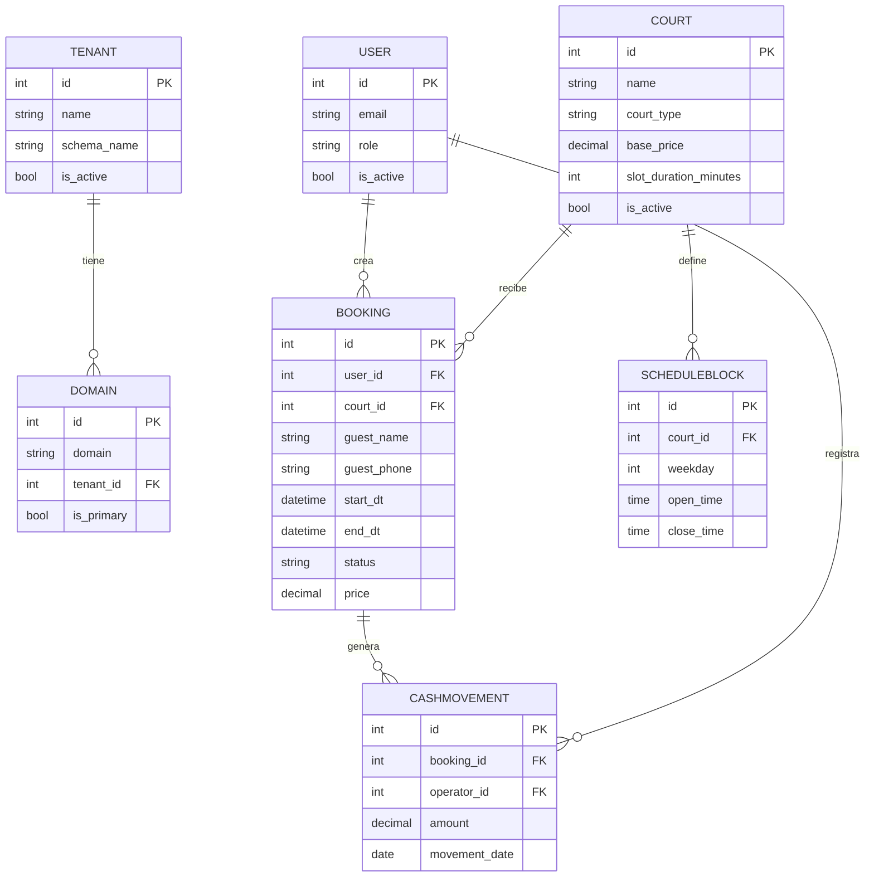

# ERS — Especificación de Requisitos de Software
# SaaS de Gestión y Reserva de Complejos Deportivos — CANCHERO!

**Versión:** 1.0  
**Fecha:** 2026-06-09  
**Estado:** Vigente  
**Autores:** Milton Messina (PO/Analista), Equipo de desarrollo (Luka, Erik, Cris, Nacho)  
**Basado en:** IEEE 830-1998 (adaptado)

---

## Tabla de contenidos

1. [Introducción](#1-introducción)
2. [Descripción General del Sistema](#2-descripción-general-del-sistema)
3. [Actores del Sistema](#3-actores-del-sistema)
4. [Requisitos Funcionales](#4-requisitos-funcionales)
5. [Requisitos No Funcionales](#5-requisitos-no-funcionales)
6. [Restricciones de Diseño y Arquitectura](#6-restricciones-de-diseño-y-arquitectura)
7. [Modelo de Datos](#7-modelo-de-datos)
8. [Workflow y Transiciones de Estado](#8-workflow-y-transiciones-de-estado)
9. [Control de Acceso (RBAC)](#9-control-de-acceso-rbac)
10. [Interfaz de API](#10-interfaz-de-api)
11. [Criterios de Aceptación del MVP](#11-criterios-de-aceptación-del-mvp)
12. [Glosario](#12-glosario)
13. [Referencias](#13-referencias)

---

## 1. Introducción

### 1.1 Propósito

Este documento especifica los requisitos del software **CANCHERO!**, un SaaS B2B multi-tenant de gestión y reserva de complejos deportivos. Está dirigido al equipo de desarrollo, a los agentes IA que construyen el sistema y a los stakeholders del proyecto (Milton, Cliente Cero).

### 1.2 Alcance

**CANCHERO!** reemplaza la gestión manual de reservas (WhatsApp + Excel) de complejos de Fútbol 5/7 y Pádel. Opera como un "recepcionista digital 24/7": cada complejo obtiene su propio entorno marca blanca con grilla de turnos pública, motor de reservas sin overbooking y caja diaria básica.

**Incluido en el MVP:**
- Módulo de aislamiento multi-tenant por esquema PostgreSQL.
- ABM de canchas (tipo, superficie, precio, duración del turno).
- Configuración de disponibilidad / horarios de apertura-cierre por cancha y día.
- Grilla pública de turnos (vista de disponibilidad para el jugador).
- Motor de reservas con control de concurrencia (sin overbooking).
- Módulo de caja diaria básico (conciliación manual de señas/transferencias).
- Autenticación JWT y control de acceso basado en roles (RBAC).
- Notificaciones por email en transiciones de estado de la reserva.

**Fuera del alcance del MVP:**
- Pasarelas de pago automáticas (MercadoPago, Stripe).
- Facturación AFIP.
- Módulo buffet / e-commerce.
- Agente de IA para WhatsApp.
- App móvil nativa.
- Celery / Redis (tareas asíncronas).

### 1.3 Definiciones, acrónimos y abreviaturas

| Término | Definición |
|---|---|
| **Tenant** | Complejo deportivo cliente del SaaS. Opera en un esquema PostgreSQL aislado. |
| **Marca blanca** | Cada tenant opera bajo su propia URL; no hay marca agregadora visible al jugador. |
| **Cancha (`Court`)** | Espacio alquilable. Tipo Fútbol 5/7 o Pádel. |
| **Turno / Slot** | Bloque horario reservable. Duración definida por `Court.slot_duration_minutes`. |
| **`ScheduleBlock`** | Bloque de disponibilidad (apertura/cierre) de una cancha por día de semana. |
| **Reserva (`Booking`)** | Relación Jugador + Cancha + fecha/hora, con estado. |
| **Seña** | Pago parcial por transferencia que el cajero concilia manualmente. |
| **Caja diaria** | Registro de movimientos de caja del día (señas/pagos confirmados). |
| **Overbooking** | Asignación de la misma cancha y horario a más de una reserva. Técnicamente imposible. |
| **SaaS** | Software as a Service. |
| **DRF** | Django REST Framework. |
| **JWT** | JSON Web Token (autenticación stateless). |
| **RBAC** | Role-Based Access Control. |
| **ADR** | Architecture Decision Record. |
| **MVP** | Minimum Viable Product. |

### 1.4 Referencias

| Documento | Ubicación |
|---|---|
| PROJECT_CONTEXT.md | `docs/PROJECT_CONTEXT.md` |
| ARCHITECTURE.md | `docs/ARCHITECTURE.md` |
| STACK.md | `docs/STACK.md` |
| RULES.md | `docs/RULES.md` |
| WORKFLOW.md | `docs/WORKFLOW.md` |
| RBAC.md | `docs/RBAC.md` |
| API_GUIDELINES.md | `docs/API_GUIDELINES.md` |
| DER.md | `docs/DER.md` |
| USER_STORIES.md | `docs/USER_STORIES.md` |
| ADR-007 a ADR-011 | `docs/adr/` |

### 1.5 Visión general del documento

La sección 2 describe el contexto del sistema y los problemas que resuelve. La sección 3 caracteriza los actores. Las secciones 4 y 5 especifican los requisitos funcionales y no funcionales. Las secciones 6 a 10 detallan restricciones, modelo de datos, workflow, permisos y contrato de API. La sección 11 define los criterios de aceptación del MVP.

---

## 2. Descripción General del Sistema

### 2.1 Perspectiva del producto

CANCHERO! es un SaaS multi-tenant de nueva creación, sin integración con sistemas legados. Cada complejo cliente opera bajo su propia URL (subdominio o dominio propio) con datos completamente aislados de los demás complejos.

```
Jugador (celular)
    ↓ HTTPS — grilla pública / reserva
Frontend React (SPA, mobile-first)
    ↓ REST API + JWT
Backend DRF (API-First)
    ↓ django-tenants
PostgreSQL (un esquema por complejo)
```

### 2.2 Problema que resuelve

Los complejos chicos y medianos gestionan reservas de forma manual y frágil:
- Reservas por WhatsApp anotadas en planilla Excel o cuaderno.
- Sin control de concurrencia: overbooking frecuente.
- Seña/pago por transferencia con conciliación "de memoria".
- Sin visibilidad de ocupación ni ingresos del día.

**Dolor principal:** *"Pierdo reservas y plata porque gestiono todo a mano por WhatsApp y Excel, y nunca sé con certeza qué cancha está libre ni cuánto entró hoy."*

### 2.3 Funciones principales del producto

1. **Gestión multi-tenant:** cada complejo tiene su entorno aislado.
2. **ABM de canchas y horarios:** configuración de recursos y disponibilidad.
3. **Grilla pública de turnos:** vista de disponibilidad para el jugador sin login.
4. **Motor de reservas:** creación sin overbooking, con concurrencia controlada.
5. **Confirmación de seña:** flujo cajero → confirmado + registro en caja.
6. **Caja diaria:** conciliación manual de movimientos del día.
7. **Autenticación y permisos:** JWT + RBAC por rol y tenant.
8. **Notificaciones por email:** al jugador y al admin en cambios de estado de la reserva.

### 2.4 Restricciones generales

- **Técnica:** aislamiento multi-tenant por esquema (`django-tenants`) condiciona migraciones y queries.
- **Legal/Negocio:** sin facturación AFIP ni pagos automáticos en el MVP.
- **Presupuestaria:** stack open-source; sin servicios pagos en el MVP.
- **Temporal:** operativo para el "Cliente Cero" dentro del semestre.

### 2.5 Suposiciones y dependencias

- El complejo ya tiene URL/dominio o subdominio configurado.
- Las señas se cobran por transferencia bancaria externa; la conciliación es manual.
- El jugador accede desde un navegador móvil.
- La zona horaria de operación es `America/Argentina/Buenos_Aires`; la base de datos guarda UTC.

---

## 3. Actores del Sistema

| Actor | Código de rol | Descripción | Canal de acceso |
|---|---|---|---|
| **Administrador de plataforma** | `system_admin` | Equipo CANCHERO!. Da de alta complejos, soporte global. Opera en esquema `public`. | Panel Django Admin / CLI |
| **Dueño del complejo** | `tenant_admin` | Administra canchas, precios, horarios y usuarios internos de su complejo. | Panel web (SPA admin) |
| **Cajero / Recepcionista** | `operator` | Personal que opera el día a día: confirma reservas, registra señas, cierra caja. | Panel web (SPA admin) |
| **Jugador / Cliente final** | `player` | Reserva turnos; puede tener cuenta o reservar como invitado. | Grilla pública (SPA móvil) |
| **Sistema** | — | Acciones automáticas (completar turnos vencidos, auditoría). | Backend interno |

---

## 4. Requisitos Funcionales

Los requisitos funcionales se organizan por módulo. Cada uno referencia la historia de usuario INVEST correspondiente de `USER_STORIES.md`.

---

### 4.1 Módulo Multi-tenant (MT)

#### RF-MT-01: Creación de tenant
El `system_admin` debe poder dar de alta un complejo (tenant) con nombre, esquema PostgreSQL y dominio. La creación genera el esquema aislado y crea el usuario `tenant_admin` inicial.  
**HU:** HU-0.2 | **Medio:** Management command `create_tenant` / Django Admin (ADR-009).

#### RF-MT-02: Resolución de tenant por dominio
El sistema debe resolver el tenant activo a partir del dominio/subdominio de la request HTTP. Toda operación posterior corre dentro del esquema de ese tenant.  
**HU:** HU-0.2

#### RF-MT-03: Aislamiento de datos
Ningún usuario puede leer ni escribir datos de un tenant distinto al de su sesión. Esto aplica incluso si conoce el ID del recurso. El aislamiento lo provee `django-tenants` a nivel de esquema.  
**HU:** HU-0.2

#### RF-MT-04: Baja lógica de tenant
El `system_admin` puede desactivar un tenant (`is_active=False`). Los datos no se borran físicamente.

---

### 4.2 Módulo de Autenticación y Usuarios (AU)

#### RF-AU-01: Login con JWT
El sistema debe emitir un par de tokens (access + refresh) al usuario que provea credenciales válidas (email/contraseña) del tenant activo.  
**HU:** HU-0.3

#### RF-AU-02: Renovación de token
El sistema debe permitir renovar el access token usando el refresh token, sin requerir nueva autenticación.  
**HU:** HU-0.3

#### RF-AU-03: Gestión de usuarios internos
El `tenant_admin` debe poder crear, editar y desactivar usuarios con rol `operator` dentro de su propio tenant.

#### RF-AU-04: Roles de usuario
El modelo de usuario soporta los roles `tenant_admin`, `operator` y `player`. Los roles condicionan permisos según la matriz RBAC (`RBAC.md`).

#### RF-AU-05: Aislamiento de usuarios
Los usuarios de un tenant no existen ni son visibles en ningún otro tenant (ADR-007). El mismo email puede estar registrado en dos tenants distintos sin conflicto.

---

### 4.3 Módulo de Canchas (CO)

#### RF-CO-01: Alta de cancha
El `tenant_admin` debe poder crear una cancha con: nombre, tipo (`FUTBOL_5` | `FUTBOL_7` | `PADEL`), superficie, precio base y duración del turno (`slot_duration_minutes`).  
**HU:** HU-7

#### RF-CO-02: Edición de cancha
El `tenant_admin` debe poder modificar nombre, tipo, superficie, precio base y duración del turno de una cancha activa.  
**HU:** HU-7

#### RF-CO-03: Desactivación de cancha
El `tenant_admin` debe poder desactivar una cancha (`is_active=False`). Una cancha inactiva no aparece en la grilla pública ni acepta nuevas reservas.  
**HU:** HU-7

#### RF-CO-04: Listado de canchas
El `tenant_admin` y el `operator` pueden listar las canchas del tenant (activas e inactivas). El `player` solo ve canchas activas en la grilla.  
**HU:** HU-7

---

### 4.4 Módulo de Disponibilidad / Horarios (HO)

#### RF-HO-01: Configuración de bloques horarios
El `tenant_admin` debe poder definir bloques de disponibilidad (`ScheduleBlock`) para cada cancha, por día de la semana, con hora de apertura y cierre.  
**HU:** HU-8

#### RF-HO-02: Validación de horario coherente
El sistema debe rechazar la creación de un `ScheduleBlock` con `open_time ≥ close_time` o que se solape con otro bloque activo de la misma cancha y día.  
**HU:** HU-8

#### RF-HO-03: Sin cruce de medianoche (MVP)
Los bloques horarios no pueden cruzar la medianoche (apertura y cierre en el mismo día).  
**HU:** HU-8

#### RF-HO-04: Grilla de disponibilidad
El sistema debe calcular la grilla de turnos disponibles para una cancha en un rango de fechas, considerando los `ScheduleBlock` activos y restando los turnos ya ocupados (`PENDING_PAYMENT` o `CONFIRMED`).  
**HU:** HU-1

---

### 4.5 Módulo de Reservas / Motor de Reservas (BO)

#### RF-BO-01: Creación de reserva como invitado
El jugador debe poder crear una reserva sin cuenta, proveyendo nombre y teléfono de contacto. La reserva nace en estado `PENDING_PAYMENT`.  
**HU:** HU-2 (ADR-008)

#### RF-BO-02: Creación de reserva con cuenta
Un jugador autenticado (JWT) debe poder crear una reserva vinculada a su cuenta. La reserva nace en `PENDING_PAYMENT`.  
**HU:** HU-2

#### RF-BO-03: Restricciones al crear reserva
El motor debe rechazar con código de error específico:
- Turno en el pasado → `BOOKING_IN_PAST`
- Cancha inactiva → `COURT_INACTIVE`
- Turno fuera del horario configurado → `OUTSIDE_SCHEDULE`
- Turno solapado con otra reserva activa → `SLOT_ALREADY_BOOKED`

**HU:** HU-2

#### RF-BO-04: Control de concurrencia (sin overbooking)
La creación de reserva debe ejecutarse dentro de una transacción con `select_for_update()` sobre la cancha/turno. Si dos requests simultáneas intentan el mismo turno solapado, solo una prospera; la otra recibe `SLOT_ALREADY_BOOKED`. El solapamiento se evalúa sobre el intervalo `[start_dt, end_dt)`, no por igualdad exacta de `start_dt`.  
**HU:** HU-3

#### RF-BO-05: Confirmación de reserva (cajero)
El `operator` o `tenant_admin` debe poder confirmar una reserva en estado `PENDING_PAYMENT`, transicionándola a `CONFIRMED`. La confirmación genera un `CashMovement` del día. El jugador no puede confirmar.  
**HU:** HU-4

#### RF-BO-06: Cancelación de reserva
- El **jugador** puede cancelar únicamente sus propias reservas (en `PENDING_PAYMENT` o `CONFIRMED`).
- El **`operator`/`tenant_admin`** puede cancelar cualquier reserva del tenant.
- La cancelación requiere un motivo explícito.
- Si la reserva estaba `CONFIRMED`, se anota la reversión en caja.
- `CANCELLED` es un estado final; no puede reactivarse.

**HU:** HU-5

#### RF-BO-07: Completar reserva
El sistema (o el `operator`/`tenant_admin`) puede transicionar una reserva `CONFIRMED` a `COMPLETED` una vez que la fecha/hora del turno ya pasó.  
**HU:** implícito en WORKFLOW.md

#### RF-BO-08: Listado de reservas
- El `operator`/`tenant_admin` puede listar todas las reservas del tenant, con filtros por cancha, estado y rango de fechas.
- El jugador con cuenta solo ve sus propias reservas.

#### RF-BO-09: Auditoría de reservas
Toda creación, confirmación, cancelación y completado de reserva genera un evento auditable con autor, tenant y timestamp.

---

### 4.6 Módulo de Caja Diaria (CA)

#### RF-CA-01: Registro de movimiento de caja
Al confirmar una reserva (`PENDING_PAYMENT → CONFIRMED`), el sistema registra automáticamente un `CashMovement` con el monto, la fecha del día, el operador y la reserva asociada.  
**HU:** HU-4

#### RF-CA-02: Listado de caja diaria
El `operator` y el `tenant_admin` deben poder ver los movimientos de caja, filtrados por fecha. El resultado queda acotado al tenant activo. El `player` no accede a la caja.  
**HU:** HU-6

#### RF-CA-03: Resumen diario de caja
El sistema debe proveer un resumen con totales del día (monto total confirmado, cantidad de reservas).

#### RF-CA-04: Inmutabilidad de movimientos
Los `CashMovement` son inmutables: no se editan ni se borran físicamente. Si una reserva confirmada se cancela, se registra un nuevo movimiento de reversión (no se modifica el original).

---

### 4.7 Módulo de Notificaciones (NO)

#### RF-NO-01: Notificación por email al cambiar estado
El sistema debe enviar un email al jugador (y opcionalmente al admin) cuando la reserva cambia de estado:
- Creación de reserva → email al jugador con datos del turno e instrucciones de seña.
- Confirmación → email al jugador confirmando el turno asegurado.
- Cancelación → email al jugador con el motivo.

#### RF-NO-02: Configurabilidad
Las notificaciones deben poder habilitarse/deshabilitarse por tenant. El envío es sincrónico en el MVP (sin Celery).

---

### 4.8 Módulo de Administración de Operadores (OP)

#### RF-OP-01: Gestión de operadores
El `tenant_admin` puede listar, crear, editar y desactivar operadores (`operator`) dentro de su tenant. No puede crear ni editar usuarios de otros tenants.

---

## 5. Requisitos No Funcionales

### 5.1 Rendimiento

| ID | Requisito |
|---|---|
| RNF-RE-01 | La grilla de disponibilidad debe responder en menos de 2 segundos bajo carga normal (hasta 50 usuarios concurrentes). |
| RNF-RE-02 | La creación de reserva (con bloqueo pesimista) debe completarse en menos de 3 segundos en condiciones de alta concurrencia. |
| RNF-RE-03 | Los listados paginados deben responder en menos de 1 segundo para páginas de hasta 50 elementos. |

### 5.2 Disponibilidad

| ID | Requisito |
|---|---|
| RNF-DI-01 | El sistema debe estar disponible 24/7 para el jugador (grilla y creación de reserva). |
| RNF-DI-02 | El mantenimiento planificado debe anunciarse con al menos 24 hs de anticipación al tenant. |

### 5.3 Seguridad

| ID | Requisito |
|---|---|
| RNF-SE-01 | Toda comunicación entre cliente y servidor debe ser por HTTPS (TLS 1.2+). |
| RNF-SE-02 | Los tokens JWT deben expirar. El access token tiene vida corta (15 min recomendado); el refresh token, más larga. |
| RNF-SE-03 | En producción, `DEBUG = False`; los errores no exponen stack traces al cliente. |
| RNF-SE-04 | No se guardan secretos, tokens ni credenciales en el repositorio. Se usan variables de entorno. |
| RNF-SE-05 | Los datos del jugador invitado (`guest_phone`) no se exponen en listados públicos. |
| RNF-SE-06 | Los endpoints públicos (grilla, creación de reserva) deben tener rate limiting para prevenir abuso. |
| RNF-SE-07 | Toda acción crítica (reserva, confirmación, cancelación, caja) es auditable. |

### 5.4 Escalabilidad

| ID | Requisito |
|---|---|
| RNF-ES-01 | Agregar un nuevo tenant no debe requerir modificación de código ni reinicio del sistema. |
| RNF-ES-02 | La arquitectura debe soportar al menos 50 tenants simultáneos sin degradación perceptible. |

### 5.5 Mantenibilidad

| ID | Requisito |
|---|---|
| RNF-MA-01 | El sistema debe estar dividido en módulos/apps por dominio (`courts`, `bookings`, `cashbox`, `users`). |
| RNF-MA-02 | Toda lógica de negocio compleja vive en `services.py` por módulo; las vistas solo orquestan. |
| RNF-MA-03 | La cobertura de tests críticos (motor de reservas, aislamiento, permisos) debe estar documentada. |
| RNF-MA-04 | La API debe estar documentada en Swagger/OpenAPI (`drf-spectacular`). |

### 5.6 Usabilidad

| ID | Requisito |
|---|---|
| RNF-US-01 | La grilla pública y el flujo de reserva deben ser mobile-first y responsivos. |
| RNF-US-02 | Toda pantalla del frontend maneja los tres estados: cargando, vacío y error. |
| RNF-US-03 | Los mensajes de error del backend deben ser comprensibles para el usuario final (no stack traces). |
| RNF-US-04 | Las horas se presentan en `America/Argentina/Buenos_Aires`; la API responde en UTC ISO 8601. |

### 5.7 Portabilidad y despliegue

| ID | Requisito |
|---|---|
| RNF-PO-01 | El entorno completo (backend + frontend + DB) debe levantarse con `docker compose up`. |
| RNF-PO-02 | Las variables de entorno sensibles se gestionan con `.env`; el repositorio solo incluye `.env.example`. |
| RNF-PO-03 | Las migraciones (shared + tenant) deben ser reproducibles sin intervención manual. |

---

## 6. Restricciones de Diseño y Arquitectura

### 6.1 Multi-tenant por esquema PostgreSQL

La estrategia de multi-tenancy es **un esquema PostgreSQL por complejo** vía `django-tenants`. Está prohibido usar una columna `tenant_id` compartida para datos críticos de reservas y caja. Esta decisión es inviolable en el MVP.

### 6.2 Backend como source of truth

El backend (Django REST Framework) es el único árbitro de disponibilidad, concurrencia, permisos, precios y transiciones de estado. El frontend nunca decide lógica de negocio. Los serializers validan estructura; los `services.py` gobiernan el negocio.

### 6.3 Concurrencia con bloqueo pesimista

Toda creación de reserva ejecuta `select_for_update()` sobre el registro de cancha/turno dentro de una transacción atómica. No hay alternativa aceptable para el MVP.

### 6.4 Soft-delete obligatorio

Está prohibido el borrado físico (`DELETE`) de cualquier entidad. Toda entidad tiene `is_active` (soft-delete), `created_at` y `updated_at`.

### 6.5 Fechas en UTC

Todas las fechas y horas se persisten en UTC en la base de datos. La conversión a `America/Argentina/Buenos_Aires` es responsabilidad exclusiva de la capa de presentación (frontend / serializer).

### 6.6 Stack congelado para el MVP

Ningún agente ni desarrollador puede agregar una dependencia pip o npm sin justificación explícita y registro ADR. Redis y Celery son Post-MVP y no se instalan en el entorno base.

---

## 7. Modelo de Datos

### 7.1 Distribución por esquemas

| Esquema | Apps contenidas | Entidades |
|---|---|---|
| `public` (shared) | `tenants` | `Tenant`, `Domain` |
| Por tenant | `users`, `courts`, `bookings`, `cashbox` | `User`, `Court`, `ScheduleBlock`, `Booking`, `CashMovement` |

### 7.2 Entidades

#### Tenant (esquema `public`)
| Campo | Tipo | Descripción |
|---|---|---|
| `id` | PK | Identificador |
| `name` | string | Nombre del complejo |
| `schema_name` | string (único) | Esquema PostgreSQL del tenant |
| `is_active` | bool | Soft-delete |
| `created_at`, `updated_at` | datetime | Timestamps UTC |

#### Domain (esquema `public`)
| Campo | Tipo | Descripción |
|---|---|---|
| `id` | PK | Identificador |
| `domain` | string | Dominio/subdominio que resuelve el tenant |
| `tenant_id` | FK → Tenant | Tenant al que pertenece |
| `is_primary` | bool | Dominio principal del tenant |

#### User (Custom, hereda `AbstractUser`) — esquema tenant
| Campo | Tipo | Descripción |
|---|---|---|
| `id` | PK | Identificador |
| `username` / `email` | string | Credenciales de login |
| `role` | enum | `tenant_admin` \| `operator` \| `player` |
| `is_active` | bool | Soft-delete |
| `created_at`, `updated_at` | datetime | Timestamps UTC |

> Nota (ADR-007): el Custom User vive en TENANT_APPS; cada complejo tiene su propia tabla de usuarios. Un mismo email puede registrarse en dos tenants sin conflicto.

#### Court (Cancha) — esquema tenant
| Campo | Tipo | Descripción |
|---|---|---|
| `id` | PK | Identificador |
| `name` | string | Nombre de la cancha |
| `court_type` | enum | `FUTBOL_5` \| `FUTBOL_7` \| `PADEL` |
| `surface` | string | Tipo de superficie |
| `base_price` | decimal | Precio base del turno |
| `slot_duration_minutes` | int | Duración del turno (ej: 60, 90) |
| `is_active` | bool | Soft-delete |
| `created_at`, `updated_at` | datetime | Timestamps UTC |

#### ScheduleBlock (disponibilidad) — esquema tenant
| Campo | Tipo | Descripción |
|---|---|---|
| `id` | PK | Identificador |
| `court_id` | FK → Court | Cancha a la que aplica |
| `weekday` | int (0–6) | Día de semana (0 = lunes) |
| `open_time` | time | Hora de apertura |
| `close_time` | time | Hora de cierre |
| `is_active` | bool | Soft-delete |
| `created_at`, `updated_at` | datetime | Timestamps UTC |

#### Booking (Reserva) — esquema tenant
| Campo | Tipo | Descripción |
|---|---|---|
| `id` | PK | Identificador |
| `user_id` | FK → User (nullable) | Jugador con cuenta (XOR con `guest_*`) |
| `guest_name` | string (nullable) | Nombre del jugador invitado |
| `guest_phone` | string (nullable) | Teléfono del invitado (no exponer públicamente) |
| `court_id` | FK → Court | Cancha reservada |
| `start_dt` | datetime (UTC) | Inicio del turno |
| `end_dt` | datetime (UTC) | Fin del turno (`start_dt + slot_duration_minutes`) |
| `status` | enum | `PENDING_PAYMENT` \| `CONFIRMED` \| `CANCELLED` \| `COMPLETED` |
| `price` | decimal | Precio calculado por el service |
| `is_active` | bool | Soft-delete |
| `created_at`, `updated_at` | datetime | Timestamps UTC |

> Regla de integridad (ADR-008): una reserva tiene **`user` XOR `guest_*`** — uno u otro, nunca ambos ni ninguno. Validado en `bookings/services.py`.

> Detección de overbooking: solapamiento de intervalos `[start_dt, end_dt)` sobre la misma `court_id` entre reservas activas (`PENDING_PAYMENT` o `CONFIRMED`), dentro de transacción con `select_for_update()`.

#### CashMovement (movimiento de caja) — esquema tenant
| Campo | Tipo | Descripción |
|---|---|---|
| `id` | PK | Identificador |
| `booking_id` | FK → Booking | Reserva asociada |
| `operator_id` | FK → User | Cajero que registró el movimiento |
| `amount` | decimal | Monto de la seña/pago |
| `movement_date` | date | Día de caja |
| `created_at` | datetime | Timestamp UTC (registro inmutable) |

### 7.3 Diagrama Entidad-Relación



---

## 8. Workflow y Transiciones de Estado

### 8.1 Estados de la Reserva (`Booking`)

| Estado | Descripción | Estado final |
|---|---|---:|
| `PENDING_PAYMENT` | Reserva creada, esperando seña/transferencia. | No |
| `CONFIRMED` | Cajero verificó la seña; turno asegurado. | No |
| `CANCELLED` | Anulada (por jugador, cajero o falta de pago). | Sí |
| `COMPLETED` | El turno ya se jugó. | Sí |

> Una reserva **nace** en `PENDING_PAYMENT` porque la seña es por transferencia externa con conciliación manual.

### 8.2 Diagrama de transiciones

```
                    [Jugador / Cajero / Admin]
                           │
                           ▼
                   PENDING_PAYMENT ──────────────────────────────┐
                           │                                     │
          [Cajero/Admin]   │ seña verificada           [Jugador/Cajero/Admin]
                           ▼                                     │
                       CONFIRMED ─────────────────────────────── │
                           │                                     │
         [Cajero/Admin]    │ turno jugado          [Cajero/Admin]│
                           ▼                                     ▼
                       COMPLETED                            CANCELLED
```

### 8.3 Tabla de transiciones válidas

| Desde | Hacia | Actor permitido | Validaciones requeridas |
|---|---|---|---|
| (nuevo) | `PENDING_PAYMENT` | Jugador / Cajero / Admin | Cancha activa, horario válido, no en pasado, sin overbooking (`select_for_update()`) |
| `PENDING_PAYMENT` | `CONFIRMED` | Cajero / Admin | Seña verificada → genera `CashMovement` |
| `PENDING_PAYMENT` | `CANCELLED` | Jugador (propia) / Cajero / Admin | Motivo obligatorio |
| `CONFIRMED` | `CANCELLED` | Cajero / Admin | Motivo obligatorio; registrar reversión en caja |
| `CONFIRMED` | `COMPLETED` | Cajero / Admin / Sistema | Solo si `start_dt` ya pasó |

### 8.4 Transiciones prohibidas

| Desde | Hacia | Motivo |
|---|---|---|
| `CANCELLED` | cualquier otro | Estado final; no se revive una reserva cancelada. |
| `COMPLETED` | cualquier otro | Estado final; el turno ya ocurrió. |
| `PENDING_PAYMENT` | `COMPLETED` | No se puede completar sin confirmar. |

### 8.5 Eventos auditables

- Creación de reserva (tenant, jugador/invitado, cancha, datetime).
- Confirmación de seña (cambio a `CONFIRMED` + movimiento de caja generado).
- Cancelación (con motivo y autor).
- Completado de turno.
- Intento de overbooking rechazado (diagnóstico).

---

## 9. Control de Acceso (RBAC)

### 9.1 Scopes

| Scope | Descripción |
|---|---|
| `global` | Acceso a la administración de tenants. Solo `system_admin`, esquema public. |
| `tenant` | Acceso acotado al esquema del propio complejo. |
| `own` | Solo los recursos propios del usuario (ej: jugador ve sus reservas). |
| `public` | Grilla de disponibilidad del complejo (lectura sin autenticación). |

### 9.2 Matriz de permisos

| Recurso | Acción | system_admin | tenant_admin | operator | player |
|---|---|:---:|:---:|:---:|:---:|
| Tenants / Complejos | Crear / Baja | ✅ | ❌ | ❌ | ❌ |
| Usuarios internos | Crear / Ver | ✅ | ✅ (su tenant) | ❌ | ❌ |
| Canchas (`Court`) | ABM | ✅ | ✅ | ❌ | ❌ |
| Horarios (`ScheduleBlock`) | Configurar | ✅ | ✅ | ❌ | ❌ |
| Grilla de disponibilidad | Ver | ✅ | ✅ | ✅ | ✅ (público) |
| Reserva (`Booking`) | Crear | ✅ | ✅ | ✅ | ✅ |
| Reserva | Confirmar (`CONFIRMED`) | ✅ | ✅ | ✅ | ❌ |
| Reserva | Cancelar | ✅ | ✅ | ✅ | ✅ (solo la propia) |
| Reserva | Ver listado completo del complejo | ✅ | ✅ | ✅ | ❌ (solo las propias) |
| Caja diaria (`CashMovement`) | Registrar / Ver | ✅ | ✅ | ✅ | ❌ |
| Configuración del complejo | Modificar | ✅ | ✅ | ❌ | ❌ |
| Operadores | Gestionar | ✅ | ✅ | ❌ | ❌ |

### 9.3 Reglas de enforcement

- Todo endpoint requiere JWT válido y pertenencia al tenant activo, excepto la grilla pública (que igual queda acotada al tenant del dominio).
- El backend valida permisos en cada request; el frontend puede ocultar acciones pero nunca es la validación definitiva.
- Ningún usuario puede inferir ni acceder a datos de otro complejo aunque conozca un ID.

---

## 10. Interfaz de API

### 10.1 Convenciones generales

- Prefijo: `/api/`
- Versión: `/api/v1/` (cambios incompatibles se versionan con ADR).
- Autenticación: `Authorization: Bearer <access_token>` (excepto endpoints públicos).
- Formato: JSON.
- Fechas: ISO 8601 con timezone UTC (`2026-06-05T20:00:00Z`).
- Naming: sustantivos en plural.

### 10.2 Endpoints principales

| Método | Ruta | Descripción | Requiere auth |
|---|---|---|:---:|
| `GET` | `/api/health/` | Healthcheck del sistema | No |
| `POST` | `/api/auth/token/` | Login (obtener access + refresh) | No |
| `POST` | `/api/auth/token/refresh/` | Renovar access token | No |
| `GET` | `/api/courts/` | Listar canchas del tenant | Sí (público: solo activas) |
| `POST` | `/api/courts/` | Crear cancha | Sí (`tenant_admin`) |
| `GET/PATCH/DELETE` | `/api/courts/{id}/` | Detalle / editar / desactivar cancha | Sí |
| `GET` | `/api/courts/{id}/availability/` | Grilla de disponibilidad de una cancha | No |
| `GET/POST` | `/api/schedule-blocks/` | Listar / crear bloques horarios | Sí |
| `GET/PATCH/DELETE` | `/api/schedule-blocks/{id}/` | Detalle / editar / desactivar bloque | Sí |
| `GET` | `/api/bookings/` | Listar reservas (del tenant o propias) | Sí |
| `POST` | `/api/bookings/` | Crear reserva | No (invitado) / Sí (cuenta) |
| `GET` | `/api/bookings/{id}/` | Detalle de reserva | Sí |
| `POST` | `/api/bookings/{id}/confirm/` | Confirmar reserva (`CONFIRMED`) | Sí (`operator`+) |
| `POST` | `/api/bookings/{id}/cancel/` | Cancelar reserva | Sí |
| `POST` | `/api/bookings/{id}/complete/` | Completar reserva | Sí (`operator`+) |
| `GET` | `/api/cash-movements/` | Listar movimientos de caja (filtro por fecha) | Sí (`operator`+) |
| `GET` | `/api/cash-movements/summary/` | Resumen/totales del día | Sí (`operator`+) |
| `GET` | `/api/users/` | Listar usuarios internos del tenant | Sí (`tenant_admin`) |
| `POST` | `/api/users/` | Crear usuario interno | Sí (`tenant_admin`) |

### 10.3 Formato de errores

```json
{
  "error": {
    "code": "SLOT_ALREADY_BOOKED",
    "message": "Ese turno ya fue reservado. Elegí otro horario.",
    "details": {
      "court": 3,
      "datetime": "2026-06-05T20:00:00Z"
    }
  }
}
```

**Códigos de error de negocio:**

| Código | Significado |
|---|---|
| `SLOT_ALREADY_BOOKED` | Overbooking evitado; el turno ya tiene una reserva activa solapada. |
| `BOOKING_IN_PAST` | Se intentó reservar un turno ya vencido. |
| `COURT_INACTIVE` | La cancha no está disponible. |
| `OUTSIDE_SCHEDULE` | El horario solicitado está fuera del bloque de disponibilidad. |
| `INVALID_TRANSITION` | Transición de estado no permitida por el workflow. |
| `VALIDATION_ERROR` | Error de validación de campos. |
| `TENANT_FORBIDDEN` | El recurso pertenece a otro tenant. |

### 10.4 Paginación

Todos los listados están paginados:

```json
{
  "count": 120,
  "next": "https://tenant.canchero.com/api/bookings/?page=2",
  "previous": null,
  "results": []
}
```

---

## 11. Criterios de Aceptación del MVP

El MVP está completo cuando se cumplen **todos** los siguientes criterios:

### 11.1 Infraestructura y cimientos

- [ ] El proyecto arranca con `docker compose up` sin configuración manual adicional.
- [ ] Backend, frontend y base de datos levantan en un único comando.
- [ ] El healthcheck `/api/health/` responde `200 OK`.
- [ ] Las migraciones `shared` y `tenant` se ejecutan automáticamente al iniciar.

### 11.2 Multi-tenant y aislamiento

- [ ] Se pueden crear al menos dos tenants con esquemas PostgreSQL aislados.
- [ ] Un usuario del tenant A no puede acceder a datos del tenant B, incluso conociendo el ID.
- [ ] Existe un test de aislamiento automatizado que lo demuestra.

### 11.3 Autenticación

- [ ] El login devuelve access + refresh token.
- [ ] El frontend adjunta el token en el header y lo renueva automáticamente.
- [ ] Las rutas protegidas devuelven `401` sin token válido.

### 11.4 Gestión de canchas y horarios

- [ ] El `tenant_admin` puede crear, editar y desactivar canchas con todos sus atributos.
- [ ] El `tenant_admin` puede configurar bloques horarios por cancha y día.
- [ ] Un `operator` o `player` recibe `403` al intentar crear/modificar canchas u horarios.

### 11.5 Grilla pública y motor de reservas

- [ ] El jugador puede ver la grilla de turnos libres/ocupados sin autenticarse.
- [ ] El jugador puede crear una reserva (como invitado o con cuenta) en estado `PENDING_PAYMENT`.
- [ ] El sistema rechaza reservas en el pasado, en canchas inactivas, fuera de horario o solapadas.
- [ ] Dos reservas simultáneas para el mismo turno → solo una prospera; la otra recibe `SLOT_ALREADY_BOOKED`.
- [ ] Existe un test de concurrencia automatizado que lo demuestra.

### 11.6 Confirmación y caja

- [ ] El cajero puede confirmar una reserva (`PENDING_PAYMENT → CONFIRMED`).
- [ ] La confirmación genera un `CashMovement` visible en la caja del día.
- [ ] El cajero ve el resumen de caja filtrado por fecha, acotado a su tenant.
- [ ] Un `player` recibe `403` al intentar confirmar o acceder a la caja.

### 11.7 Cancelación

- [ ] El jugador puede cancelar sus propias reservas.
- [ ] El cajero puede cancelar cualquier reserva del tenant con motivo.
- [ ] Una reserva cancelada no puede reactivarse.

### 11.8 Auditoría y documentación

- [ ] Toda creación, confirmación y cancelación de reserva queda registrada con autor y timestamp.
- [ ] La API está documentada en Swagger y accesible en `/api/schema/swagger-ui/`.

### 11.9 Notificaciones

- [ ] El jugador recibe un email al crear, confirmar y cancelar su reserva.

---

## 12. Glosario

Ver sección 1.3 y `docs/PROJECT_CONTEXT.md §7`.

---

## 13. Referencias

| Referencia | Descripción |
|---|---|
| `docs/PROJECT_CONTEXT.md` | Contexto de negocio, actores, alcance, métricas de éxito. |
| `docs/ARCHITECTURE.md` | Capas del sistema, service layer, módulos, decisiones ADR. |
| `docs/STACK.md` | Stack tecnológico oficial y versiones. |
| `docs/RULES.md` | Reglas inviolables de arquitectura, seguridad, frontend y backend. |
| `docs/WORKFLOW.md` | Estados y transiciones de la reserva. |
| `docs/RBAC.md` | Roles, permisos y matriz de acceso. |
| `docs/API_GUIDELINES.md` | Convenciones de diseño de API, errores, paginación. |
| `docs/DER.md` | Modelo de datos core (DER). |
| `docs/USER_STORIES.md` | Historias de usuario INVEST. |
| `docs/adr/ADR-007` | Custom User en TENANT_APPS. |
| `docs/adr/ADR-008` | Reserva como invitado o con cuenta. |
| `docs/adr/ADR-009` | Alta de tenant por management command. |
| `docs/adr/ADR-010` | CORS headers. |
| `docs/adr/ADR-011` | Modelo base abstracto (TimeStampedSoftDeleteModel). |
| IEEE 830-1998 | Estándar base para la estructura de este documento. |

---

*Documento generado a partir de la documentación fuente del proyecto. Ante cualquier contradicción, los documentos fuente referenciados (especialmente `RULES.md` y `ARCHITECTURE.md`) prevalecen sobre este documento.*
